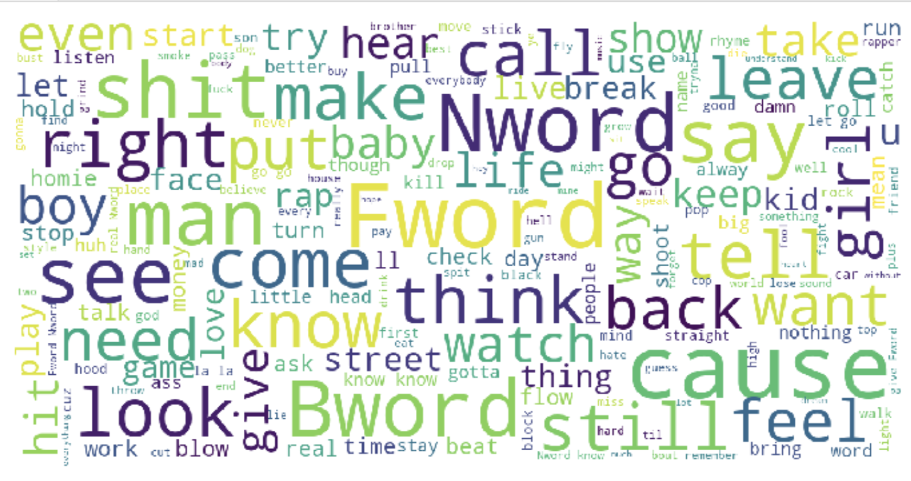
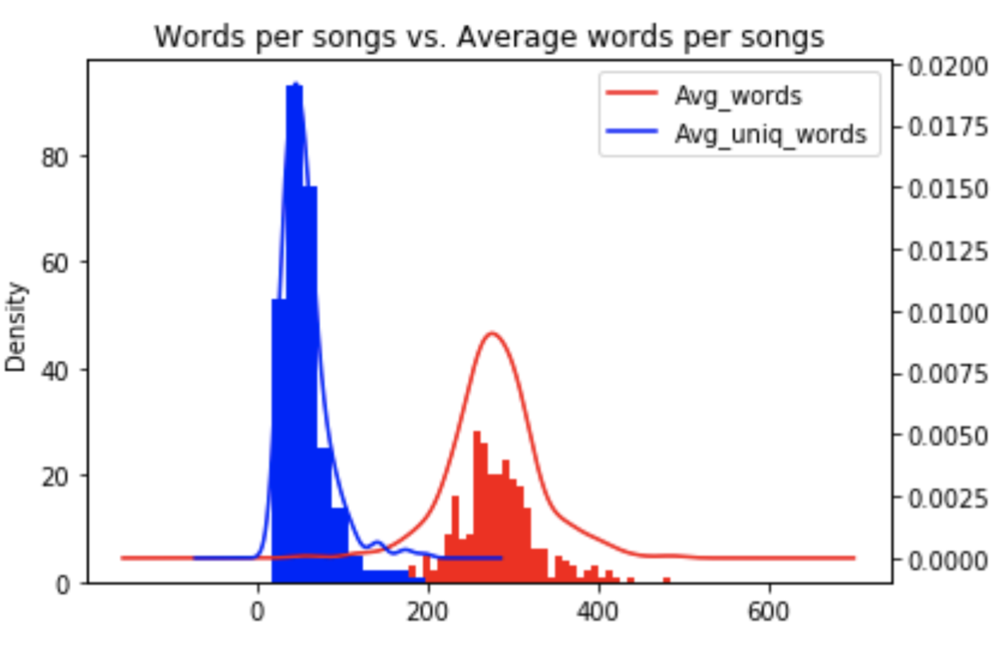
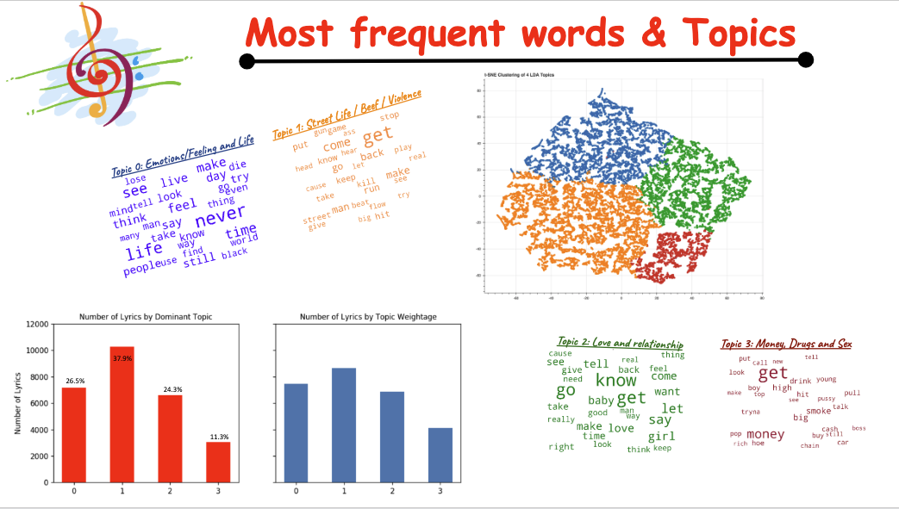
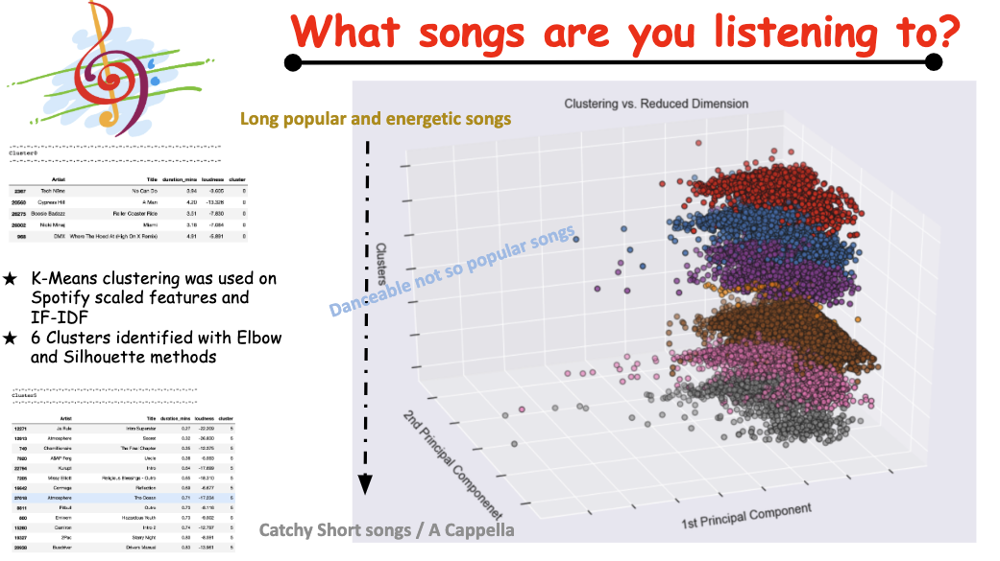
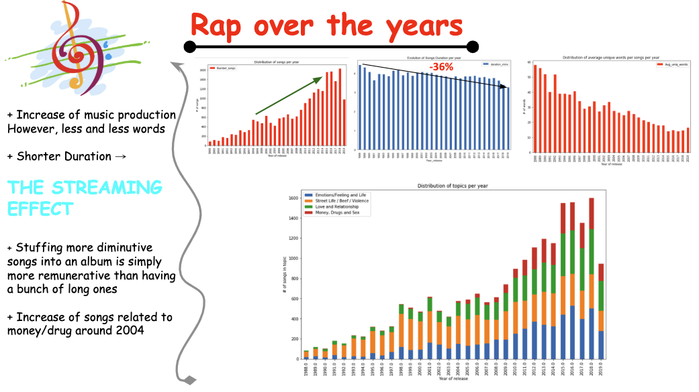

# HIP HOP CLUSTERS
Applying Natural Language Processing and machine learning to Hip-Hop lyric and song to find sub-genres and sub-categories
________________________________________________________________________________________________________________

# INTRO

Since 1979, rap spread from its New York epicenter throughout the remainder of the U.S. (with each region taking on its own specific flavor) and then to countless countries. Even though Rap's core components are beats and rhymes, rap lyircs got their own touch as well. Over the year, lot of people try to create genres of music of schools of rappers. Most of them very subjective and arguable. Using machine learning techniques and Natural Language Processing tools, I want to confront popular opinion and find topics & categories of Hip Hop songs.

# QUESTIONS
Questions guiding my research:

1. What are the different subjects discussed in Hip Hop?
2. How has the artist vocabulary and music changed over time?
3. Are there different clusters in Hip Hop or all music similar?
4. How did hip-hop musics change over time?

# MY DATA
55k+ Songs from 1979 to 2019 collected from 300 artists. I proceed by getting a list of rappers (814) from ranker.com then, collect the lyrics on Genuis.
After downloading songs features on Spotify - I kept only the ones with both lyrics and tracks audio features. Inital processing on my lyrics shows the words below as most used and revealed the need for a topic modeling.

# Topic Modeling
After cleaning and vectorizing the lyrics, I appplied Latent Dirichent Allocation (LDA) to get topics.

#### A distribution of words and unique words using for all songs

#### Results of LDA and Distribution of topics accross all songs

# Clustering

# Findings
Overall, the research showed an increase of music production over the years. However, the songs are getting shorter and contained few words. 
Additional search showed that it is a result of the streaming industry changing the music production.

- Establish 4 topics on 27k+ lyrics using Latent Dirichlet Allocation
- 7 Clusters found using K-Means
- Evolution of the music industry over the years

